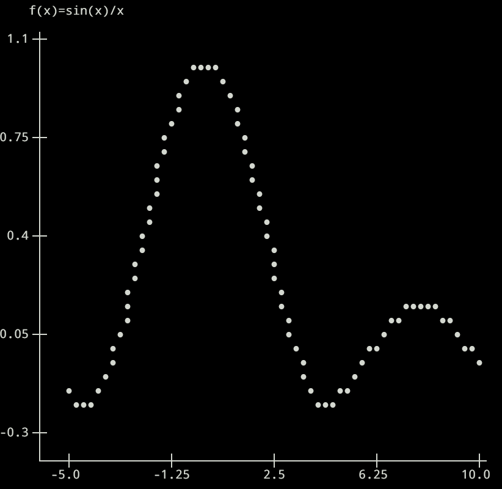
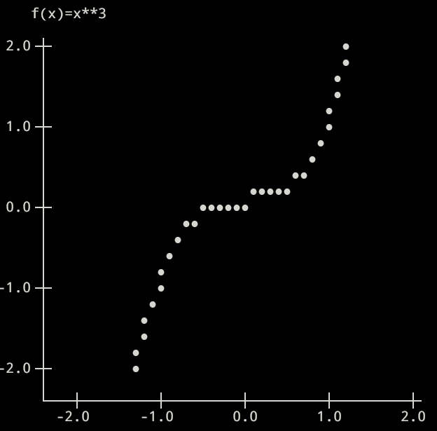
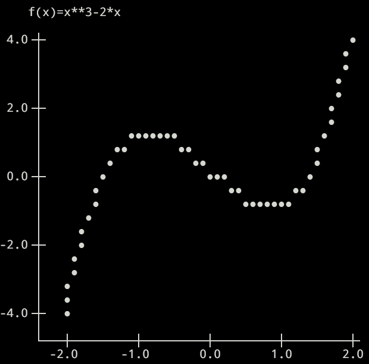
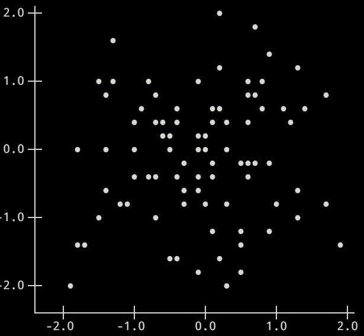

## About
-----------
This is a simple CLI-based program that acts as a graphing calculator in the terminal. The default behavior is to take a python-formatted function as input which is then output as a graph in the terminal.  There is also functionality for a `.csv` file input formatted as pairs of (x,y) points which is then graphed in the terminal.  The program  can plot any of the usual real, piecewise continuous functions available in Python's `math` module.

## Plotting Functions:
-----------
In order to plot functions one runs something along the lines of:
```
termgraph -x -5 10 -y -.3 1.1 -s 1.4 "sin(x)/x"
```


Here the `-x` and `-y` flags are for setting the domain and range of the graph.  The scale multiplier is set by `-s`, this makes the graph larger on your screen.

Alternatively, for a polynomial with no optional settings the default would just be:
```
termgraph "x**3"
```


If you would like the range to be auto-set you can use the `-a` flag:
```
termgraph "x**3 - 2*x" -a
```


## Plotting Data
-----------
In order to plot data you must set the `-l` flag and provide a path to a `.csv`.  For example:
```
termgraph -l test/test_data.csv
```


The test data here is created by running the test.py program available in the test directory; its just some gaussian data centered at 0.  
If you dont have two column csv data readily available this would be an easy way to play with the 
scatter plot functionality.  To generate the data, inside the main directory simply run
```
python3 test/test.py [NUM DATA PTS TO GENERATE]
```

The `-a` flag is also available for lists of data in which case it scales the x and y axes to fit all points.  This is very useful if you do not know the scale of the data you want to plot